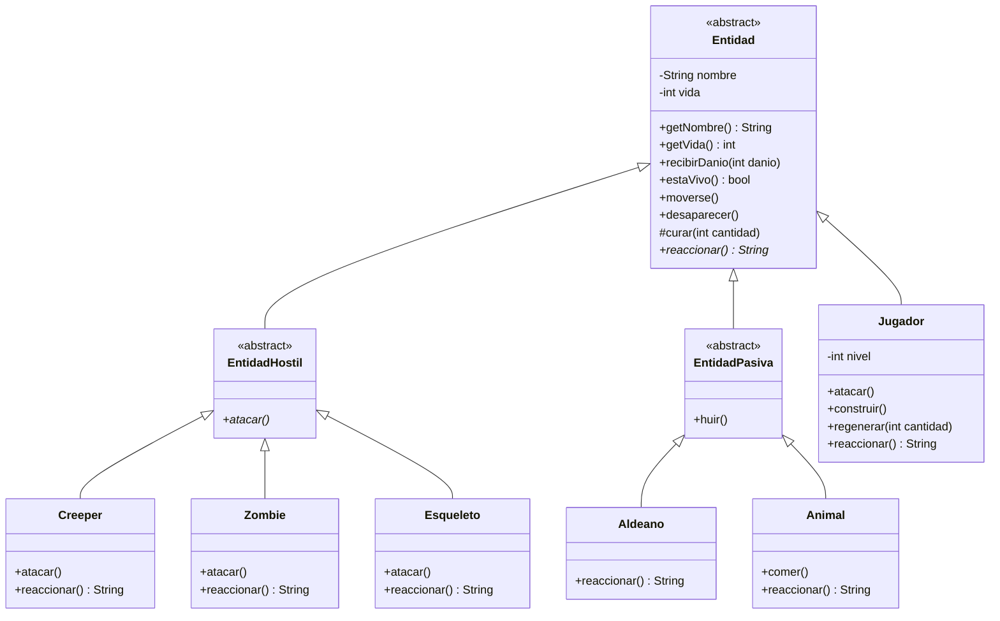

# Minecraft API — Taller de Git 2026

API REST hecha con Spring Boot que expone el modelado de clases de Minecraft
visto en las clases (herencia, sobreescritura y ocultamiento de la
información), como parte del Taller de Git.

## Tecnologías

- Java 21
- Spring Boot 4 (Spring Web MVC)
- Maven

## Cómo correr el proyecto

```bash
git clone https://github.com/CeciBasu/clbasualdo-tplp3-2026.git
cd clbasualdo-tplp3-2026/minecraft
./mvnw spring-boot:run
```

La aplicación queda disponible en `http://localhost:8080`.

Para ver la demostración por consola, sin levantar la API:

```bash
./mvnw -q compile
java -cp target/classes py.edu.uc.lp3.clbasualdo.minecraft.demo.Main
```

## Estructura

| Paquete | Qué contiene |
|---|---|
| `py.edu.uc.lp3.clbasualdo.minecraft` | El dominio: `Entidad` y sus hijas. No depende de nada externo. |
| `py.edu.uc.lp3.clbasualdo.minecraft.controller` | La entrada HTTP: arma y devuelve datos, no decide reglas. |
| `py.edu.uc.lp3.clbasualdo.minecraft.demo` | `Main`, la demostración en consola. Vive aparte del dominio. |
| `MinecraftApplication` | Arranque de Spring Boot. Se queda en la raíz porque desde ahí sale el barrido de controladores. |

## Modelo de dominio

El modelo trata cualquier entidad de forma uniforme (moverse, recibir daño,
desaparecer, reaccionar ante el jugador) sin preguntar de qué tipo concreto
se trata. Las reglas de vida, movimiento y muerte viven en `Entidad`, la
clase base: cada subclase solo redefine lo que realmente cambia.

`nombre` y `vida` son `private`: nadie fuera de la jerarquía puede dejar una
entidad en un estado inválido, ni siquiera las propias hijas. El estado
cambia únicamente a través de mensajes (`recibirDanio`, `curar`) que
validan lo que reciben. `curar()` es `protected` porque no es una operación
que cualquier entidad deba poder recibir desde afuera (un `Creeper` no se
regenera): es una herramienta interna de la jerarquía que usa `Jugador`.

`reaccionar()` es un método abstracto declarado en `Entidad`: expresa un
comportamiento que todas las hijas deben saber responder, pero cuya forma
concreta no puede escribir el padre porque cada tipo se comporta distinto
(un `Creeper` explota, un `Esqueleto` dispara, un `Aldeano` huye).



## Endpoints

| Método | Ruta | Descripción |
|---|---|---|
| `GET` | `/` | Confirma que el servicio está vivo. |
| `GET` | `/esqueleto?nombre=...&vida=...` | Construye un `Esqueleto` con los parámetros de la URL y devuelve su estado en JSON. |
| `GET` | `/comportamiento` | Devuelve, en JSON, la reacción de una entidad de cada tipo frente al jugador. Todas se tratan como `Entidad`: no hay ningún `if` por tipo, cada objeto informa lo suyo. |

### Ejemplo — `GET /esqueleto?nombre=Bony&vida=15`

```json
{
  "nombre": "Bony",
  "vida": 15,
  "vivo": true,
  "flechas": 16,
  "posicion": { "x": 0.0, "y": 64.0, "z": 0.0 }
}
```

Los parámetros `x`, `y` y `z` son opcionales y por defecto `(0, 64, 0)`. Si un dato no
es válido, la API responde `400` con el mensaje del dominio, sin tirar la excepción:

```json
{ "error": "La vida inicial debe ser mayor a 0." }
```

### Ejemplo — `GET /comportamiento`

```json
[
  {
    "tipo": "Zombie",
    "reaccion": "Zombie gruñe y persigue al jugador.",
    "vida": 20,
    "posicion": { "x": 0.0, "y": 0.0, "z": 0.0 }
  },
  {
    "tipo": "Esqueleto",
    "reaccion": "Esqueleto retrocede y dispara una flecha.",
    "vida": 20,
    "posicion": { "x": 0.0, "y": 0.0, "z": 0.0 }
  },
  {
    "tipo": "Creeper",
    "reaccion": "Creeper se acerca silbando y está a punto de explotar.",
    "vida": 20,
    "posicion": { "x": 0.0, "y": 0.0, "z": 0.0 }
  },
  {
    "tipo": "Aldeano",
    "reaccion": "Aldeano se asusta y corre a esconderse.",
    "vida": 20,
    "posicion": { "x": 0.0, "y": 0.0, "z": 0.0 }
  },
  {
    "tipo": "Animal",
    "reaccion": "Vaca sigue comiendo, no le presta atencion al jugador.",
    "vida": 10,
    "posicion": { "x": 0.0, "y": 0.0, "z": 0.0 }
  }
]
```

## Pruebas

```bash
./mvnw test
```

39 pruebas sobre el dominio: los límites de vida y el ocultamiento de estado
(`EntidadTest`), el radio y la unicidad de la explosión (`CreeperTest`), la huida y
el borde exacto de peligro (`EntidadPasivaTest`), la munición y el alcance del
esqueleto (`EsqueletoTest`), el inventario y la experiencia (`JugadorTest`), y que
la jerarquía se use sin preguntar por el tipo (`PolimorfismoTest`).

## Licencia

Este proyecto está bajo licencia Apache 2.0. Ver [LICENSE](./LICENSE).
