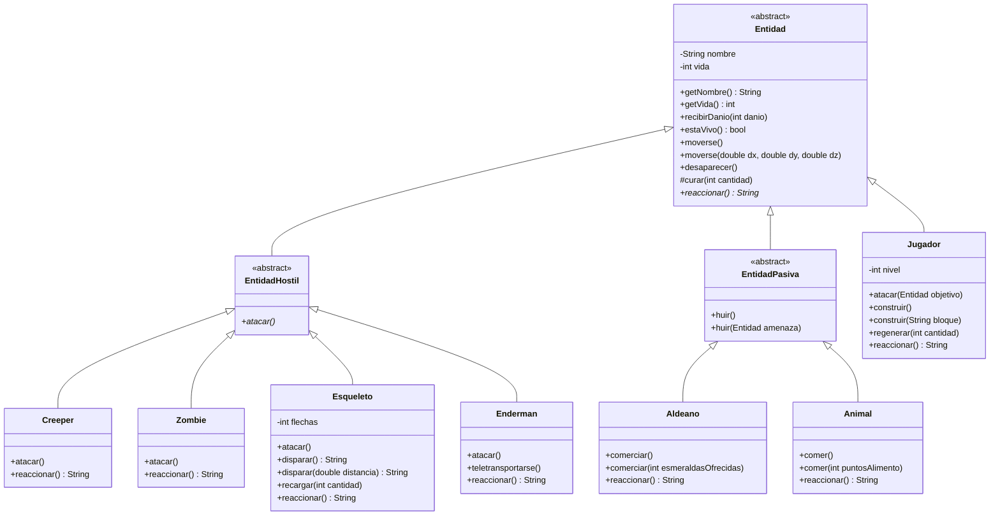

# Minecraft API — Taller de Git 2026

API REST hecha con Spring Boot que expone el modelado de clases de Minecraft
visto en las clases (herencia, sobreescritura y ocultamiento de la
información), como parte del Taller de Git.

**Commit de la solución (POO-06):**
<https://github.com/CeciBasu/clbasualdo-taller-git-2026/commit/9b9fa62536850aa072ddda183e68c94871fb2eca>

## Tecnologías

- Java 21
- Spring Boot 4 (Spring Web MVC)
- Maven

## Cómo correr el proyecto

```bash
git clone https://github.com/CeciBasu/clbasualdo-taller-git-2026.git
cd clbasualdo-taller-git-2026/minecraft
./mvnw spring-boot:run
```

La aplicación queda disponible en `http://localhost:8080`.

Para ver la demostración por consola, sin levantar la API:

```bash
./mvnw -q compile
java -cp target/classes py.edu.uc.lp3.clbasualdo.minecraft.demo.Main
```

## Estructura

| Paquete | Qué contiene |
|---|---|
| `py.edu.uc.lp3.clbasualdo.minecraft.domain` | El modelo: `Entidad` y sus hijas. No depende de nada externo. |
| `py.edu.uc.lp3.clbasualdo.minecraft.repository` | El contrato para guardar y recuperar entidades. `.impl` es la versión en memoria. |
| `py.edu.uc.lp3.clbasualdo.minecraft.service` | Las reglas de negocio (crear un esqueleto, armar la lista de comportamientos, ejecutar las dos versiones de `disparar()` y devolver un `DisparoResultado`). `.impl` tiene las implementaciones. |
| `py.edu.uc.lp3.clbasualdo.minecraft.rest.controller` | La entrada HTTP: recibe los datos, delega en los servicios y arma la respuesta. |
| `py.edu.uc.lp3.clbasualdo.minecraft.constants` | `ApiPaths`, con las rutas de la API en un solo lugar. |
| `py.edu.uc.lp3.clbasualdo.minecraft.exceptions` | Excepciones propias del juego (`MinecraftException` y `DatosInvalidosException`). |
| `py.edu.uc.lp3.clbasualdo.minecraft.demo` | `Main`, la demostración en consola. Vive aparte del dominio. |
| `MinecraftApplication` | Arranque de Spring Boot. Se queda en la raíz porque desde ahí sale el barrido de componentes. |

## Modelo de dominio

El modelo trata cualquier entidad de forma uniforme (moverse, recibir daño,
desaparecer, reaccionar ante el jugador) sin preguntar de qué tipo concreto
se trata. Las reglas de vida, movimiento y muerte viven en `Entidad`, la
clase base: cada subclase solo redefine lo que realmente cambia.

`nombre` y `vida` son `private`: nadie fuera de la jerarquía puede dejar una
entidad en un estado inválido, ni siquiera las propias hijas. El estado
cambia únicamente a través de mensajes (`recibirDanio`, `curar`) que
validan lo que reciben. `curar()` es `protected` porque no es una operación
que cualquier entidad deba poder recibir desde afuera (un `Creeper` no se
regenera): es una herramienta interna de la jerarquía que usa `Jugador`.

`reaccionar()` es un método abstracto declarado en `Entidad`: expresa un
comportamiento que todas las hijas deben saber responder, pero cuya forma
concreta no puede escribir el padre porque cada tipo se comporta distinto
(un `Creeper` explota, un `Esqueleto` dispara, un `Enderman` se teletransporta,
un `Aldeano` huye).



## Sobrecarga y sobreescritura

Las dos están en el modelo, y conviene no confundirlas: son mecanismos distintos que se
resuelven en momentos distintos de la ejecución.

### Qué se agregó

**Sobreescritura.** `Entidad` declara el método abstracto

```java
public abstract String reaccionar();
```

porque sabe que toda entidad tiene que saber responder ante el jugador, pero no sabe *cómo*:
eso solo lo sabe cada tipo. Lo sobreescriben las siete clases concretas con la misma firma
exacta y su propio cuerpo: `Zombie`, `Esqueleto`, `Creeper`, `Enderman`, `Aldeano`, `Animal` y
`Jugador`. Lo mismo pasa con `EntidadHostil.atacar()`, abstracto, que sobreescriben `Creeper`,
`Zombie`, `Esqueleto` y `Enderman`.

```java
// Entidad.java — la base no puede resolverlo
public abstract String reaccionar();

// Creeper.java — misma firma, cuerpo propio
@Override
public String reaccionar() {
    return getNombre() + " se acerca silbando y está a punto de explotar.";
}

// Aldeano.java — misma firma, otro cuerpo
@Override
public String reaccionar() {
    return getNombre() + " se asusta y corre a esconderse.";
}
```

**Sobrecarga.** El mismo nombre, otra lista de argumentos, todo en la misma clase. La más
nueva es `Esqueleto.disparar()`, que es el caso que pide la consigna: la misma acción de
disparar, con y sin distancia.

```java
// Sin datos: no hay nada que revisar, siempre gasta flecha si le queda alguna.
public String disparar() {
    return disparar(0.0);
}

// Con datos: aparece el contexto. Fuera del rango la flecha se pierde y no se gasta,
// y una distancia negativa se rechaza.
public String disparar(double distancia) { /* ... */ }
```

Las demás sobrecargas del modelo, para que se vea que el patrón ya venía usándose:

| Clase | Versión simple | Versión sobrecargada |
|---|---|---|
| `Esqueleto` | `disparar()` | `disparar(double distancia)` |
| `Entidad` | `moverse()` | `moverse(double dx, double dy, double dz)` |
| `EntidadPasiva` | `huir()` | `huir(Entidad amenaza)` |
| `Aldeano` | `comerciar()` | `comerciar(int esmeraldasOfrecidas)` |
| `Animal` | `comer()` | `comer(int puntosAlimento)` |
| `Jugador` | `construir()` | `construir(String bloque)` |

### Cómo se distingue una de la otra

|  | Sobrecarga | Sobreescritura |
|---|---|---|
| **Dónde** | En la misma clase | En clases distintas de la jerarquía |
| **Qué cambia** | La lista de argumentos | El cuerpo, con la misma firma |
| **Cómo se marca** | No lleva nada especial | Con `@Override` |
| **Cuándo se resuelve** | Al compilar, por la firma | Al ejecutar, por el tipo real del objeto |
| **Para qué sirve** | Darle una versión corta a una acción que tiene una versión completa | Cambiar un comportamiento que el padre no puede saber |

La diferencia clave: si `ComportamientoController` recorre una `List<Entidad>` y llama a
`reaccionar()`, Java no sabe de antemano qué clase es cada elemento. Eso es sobreescritura,
y funciona sin un solo `if` por tipo. En cambio, cuando dentro de `Esqueleto` se llama a
`disparar(5.0)`, el compilador ya sabe que es la versión con `double`: eso es sobrecarga, y
no tiene nada que ver con la herencia.

## Endpoints

| Método | Ruta | Descripción |
|---|---|---|
| `GET` | `/` | Confirma que el servicio está vivo. |
| `GET` | `/esqueleto?nombre=...&vida=...` | Construye un `Esqueleto` con los parámetros de la URL y devuelve su estado en JSON. |
| `GET` | `/esqueleto/disparar` | Muestra la **sobrecarga** de `disparar()` en acción: crea un `Esqueleto` desde la URL, ejecuta `disparar()` y `disparar(double distancia)` y devuelve los dos resultados en el mismo JSON. |
| `GET` | `/comportamiento` | Devuelve, en JSON, la reacción de una entidad de cada tipo frente al jugador. Todas se tratan como `Entidad`: no hay ningún `if` por tipo, cada objeto informa lo suyo. |

### Ejemplo — `GET /esqueleto?nombre=Bony&vida=15`

```json
{
  "nombre": "Bony",
  "vida": 15,
  "vivo": true,
  "flechas": 16,
  "posicion": { "x": 0.0, "y": 64.0, "z": 0.0 }
}
```

Los parámetros `x`, `y` y `z` son opcionales y por defecto `(0, 64, 0)`. Si un dato no
es válido, la API responde `400` con el mensaje del dominio, sin tirar la excepción:

```json
{ "error": "La vida inicial debe ser mayor a 0." }
```

### Ejemplo — `GET /esqueleto/disparar?nombre=Bony&distancia=5`

Acá se ve la sobrecarga: las dos versiones del mismo mensaje, en el mismo JSON.

```json
{
  "nombre": "Bony",
  "flechasIniciales": 16,
  "flechasRestantes": 14,
  "rango": 8.0,
  "distanciaPedida": 5.0,
  "disparoSinDistancia": "Bony dispara una flecha a 0.0. Le quedan 15.",
  "disparoConDistancia": "Bony dispara una flecha a 5.0. Le quedan 14."
}
```

Y con una distancia fuera del rango se ve la diferencia entre las dos versiones: el disparo
sin distancia gasta la flecha igual, el que lleva distancia no, porque la flecha se pierde.

```json
{
  "nombre": "Bony",
  "flechasIniciales": 16,
  "flechasRestantes": 15,
  "rango": 8.0,
  "distanciaPedida": 20.0,
  "disparoSinDistancia": "Bony dispara una flecha a 0.0. Le quedan 15.",
  "disparoConDistancia": "Bony no alcanza a disparar a 20.0 (rango 8.0) y no gasta flecha."
}
```

Una distancia negativa la rechaza el dominio y la API la avisa con `400`:

```json
{ "error": "La distancia no puede ser negativa." }
```

### Ejemplo — `GET /comportamiento`

```json
[
  {
    "tipo": "Zombie",
    "reaccion": "Zombie gruñe y persigue al jugador.",
    "vida": 20,
    "posicion": { "x": 0.0, "y": 0.0, "z": 0.0 }
  },
  {
    "tipo": "Esqueleto",
    "reaccion": "Esqueleto retrocede y dispara una flecha.",
    "vida": 20,
    "posicion": { "x": 0.0, "y": 0.0, "z": 0.0 }
  },
  {
    "tipo": "Creeper",
    "reaccion": "Creeper se acerca silbando y está a punto de explotar.",
    "vida": 20,
    "posicion": { "x": 0.0, "y": 0.0, "z": 0.0 }
  },
  {
    "tipo": "Enderman",
    "reaccion": "Enderman se teletransporta al ser observado.",
    "vida": 40,
    "posicion": { "x": 0.0, "y": 0.0, "z": 0.0 }
  },
  {
    "tipo": "Aldeano",
    "reaccion": "Aldeano se asusta y corre a esconderse.",
    "vida": 20,
    "posicion": { "x": 0.0, "y": 0.0, "z": 0.0 }
  },
  {
    "tipo": "Animal",
    "reaccion": "Vaca sigue comiendo, no le presta atencion al jugador.",
    "vida": 10,
    "posicion": { "x": 0.0, "y": 0.0, "z": 0.0 }
  }
]
```

## Pruebas

```bash
./mvnw test
```

56 pruebas. Sobre el dominio: los límites de vida y el ocultamiento de estado
(`EntidadTest`), el radio y la unicidad de la explosión (`CreeperTest`), la huida y
el borde exacto de peligro (`EntidadPasivaTest`), la munición, el alcance del
esqueleto y las dos versiones de `disparar()` (`EsqueletoTest`), el ataque y la reacción
del Enderman (`EndermanTest`), el inventario y la experiencia (`JugadorTest`), y que la
jerarquía se use sin preguntar por el tipo (`PolimorfismoTest`). Sobre la entrada HTTP,
`ApiControllerTest` levanta el contexto con MockMvc y prueba las cuatro rutas, incluido
que un dato inválido termine en `400` y no en un `500`.

## Bitácora y documentación

- **[`docs/BITACORA.md`](docs/BITACORA.md)** — bitácora de la entrega: con qué asistentes y
  qué modelos de LLM se trabajó, el resumen de los prompts, y el relato de cómo se fue
  tocando la jerarquía.

## Resumen de chat con el agente

**1. Endurecimiento del proyecto Minecraft (POO)**
Mejoramos toda la jerarquía de clases para que dejara de ser "solo prints" y tuviera comportamiento real:
- **`Entidad`**: se le agregaron coordenadas `x, y, z`, métodos de movimiento (`moverse`, `teletransportar`), cálculo de distancia entre entidades (`distanciaHacia`), `vidaMaxima`, y `toString()`/`equals()`/`hashCode()`.
- **`EntidadHostil`**: ataque real con `danioAtaque` y `rangoAtaque` — el método `golpear(objetivo)` valida rango y vida antes de aplicar daño.
- **`EntidadPasiva`**: huida real (`huir(amenaza)`) que se mueve en base a la posición de la amenaza, y detección de peligro (`estaEnPeligro`).
- **Subclases específicas**: `Zombie` rompe puertas, `Esqueleto` tiene munición de flechas y recarga, `Creeper` explota en área y se autodestruye, `Aldeano` comercia con esmeraldas, `Animal` se domestica y reproduce.
- **`Jugador`**: inventario, experiencia con subida de nivel, y ataque real con chequeo de rango.
- **Controllers**: `EsqueletoController` ahora acepta posición por parámetros de URL y devuelve error 400 con `ResponseEntity` ante datos inválidos; `ComportamientoController` devuelve vida y posición de más entidades.
- Te entregué todos los `.java` actualizados más un `.zip` con la estructura de paquetes lista para copiar.

**2. Cómo probar la API**
EL agente me explico que con la app corriendo (`MinecraftApplication`), se accede por `http://localhost:8080/`, `/comportamiento` y `/esqueleto` (este último acepta `?nombre=&vida=&x=&y=&z=`), y que no hace falta ningún otro link salvo que quiera exponerlo fuera de mi red local.

**3. Git: ramas divergentes**
Resolvimos un caso real de mi repo donde mi rama local y `origin/main` habían divergido (mi commit de las entidades vs. 2 commits de README subidos por mi compañera). EL agente me explicò por qué pasó, y la solución fue `git pull --rebase origin main` para reordenar mi commit arriba de los del remoto sin conflictos, seguido de `git push`.

**4. README, diagrama de clases y comentarios en el código** 
Armamos el README explicando el código y agregamos el diagrama de clases. Además, me ayudo a comentar todo el código(como para que pudiera entender mejor todo lo que iba haciendo).

**5. Estado y entrega**
- Verificamos que `main` remoto quedaba igual a mi local tras el push.
- Cloné el repo desde cero (como el corrector) y confirmé que compila y arranca sin `target/` ni archivo basura.

**6. Enderman / PR**
- Corregí el Enderman (`super("Enderman", 40, 7, 16.0)`) y lo sumé a `/comportamiento`.
- Lo dejé en la rama de la compañera; y mergee el PR #1 (fast-forward, sin conflictos).
- Agregué `EndermanTest` (5 tests) → total 44 tests.

**7. Documentación**
- Actualicé el README: Enderman en el diagrama, 6.ª entidad en el ejemplo, y "44 pruebas".
- Commiteado y subido.

**8. Refactor estilo template (lo que pediste)**
- El agente movio el proyecto a capas: `domain`, `repository` (+impl), `service` (+impl), `rest.controller`, `constants` y `exceptions`.
- Dejo `MinecraftApplication` en la raíz y el dominio puro (sin Spring).
- Movio los tests del dominio a su paquete espejo.
- Todo commiteado y subido en `a1ca752`.

**9. Verificaciones que pasaron**
- `./mvnw test` → 44 tests, BUILD SUCCESS.
- Endpoints iguales: `/`, `/comportamiento` (6 entidades), `/esqueleto` y el error 400 de `vida=0`.
- El demo de consola (`Main`) corre bien.

**10. Rúbricas**
- Paquetes mejoró con el refactor; el resto se mantuvo OK.

**Después de este resumen (revisión final).** Se agregó la sobrecarga
`Esqueleto.disparar()` con su ruta `/esqueleto/disparar`, el apartado de sobrecarga y
sobreescritura de este README y las pruebas de la entrada HTTP. Las pruebas pasaron de
44 a **56**. El detalle de esa revisión está en [`docs/BITACORA.md`](docs/BITACORA.md).

## Licencia

Este proyecto está bajo licencia Apache 2.0. Ver [LICENSE](./LICENSE).
